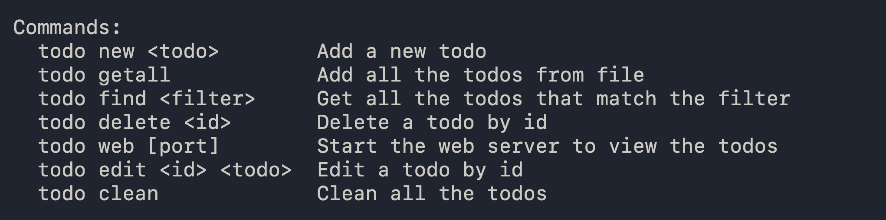
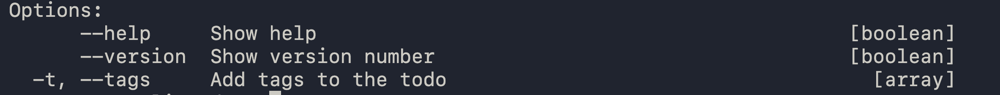

# Todo-with-cli

- Todo-with-cli is simple nodejs based project to create todos within the terminal cli.
- Simple open-source project

## Install

`npm install`
`npm link`

## Commands

## Options

### I am Note Explainer If you like it you can help the project

## Todo

1. Interative web version for this cli-todo
2. Replace real DB with JSON file in v2.0.0
3. Add deleteByTag, EditByTag, FindByTag commands
4. Add Sort and Search commands for Web
5. React/NextJS for frontend
